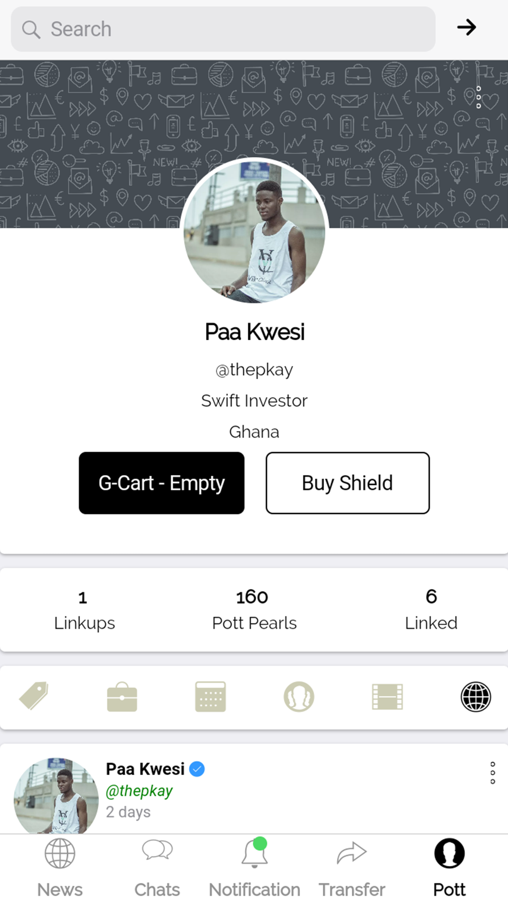

# FISHPOTT(Lite) - Social-Commerce Networking 

**FishPott is a socio-commerce networking platformthat connects you, friends and businesses. Find a business you love, and invest in them. If it's doing well, you can easily tell your friends to invest too. Stay connected to the business and watch as the medium-sized business you believed in grow and scale, increasing the value of your investment and paying you dividends**
-  `I did not know about Git and pushing code to remote repositories when I was doing this project a couple of years ago. This is to explain the few commits made. I just pushed the code recently for public viewing`
## Features

* Connect with businesses and people
* Invest by buying stocks of businesses around the world
* Transfer stocks with ease
* Chat/Messenger

## Screenshots
 

   <table align="center" border="0" >
  <tr>
    <td>
      
    <td>
      
    </td>
    <td> 
     
    </td>
    <td> 
     
    </td>
  </table>
  

## Authors

* **Dankyi Anno Kwaku**

